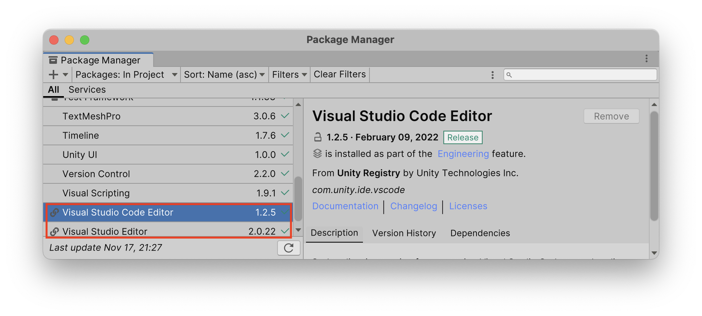
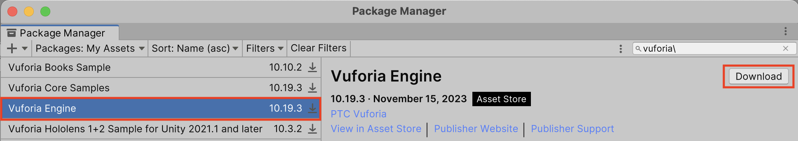
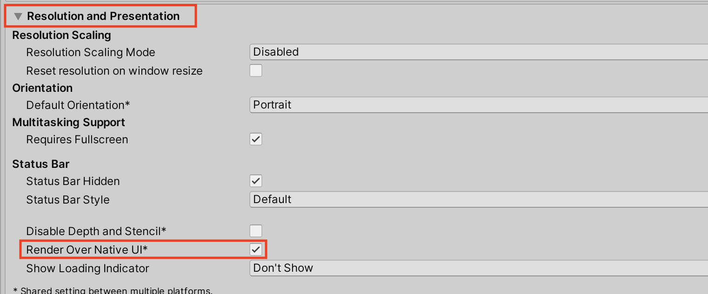

# FurbotPOC

Furbot - Provas de Conceito usando Unity e outras tecnologias.

- P: publicado na loja PlayStore (Android)  
- A: publicado na loja AppleStore (Apple)  
- D: publicado na loja Steam  
- W: publicado na Web  

## GitHub

[GitHub](https://github.com/LDTTFURB/site/tree/main/projetoEnsino/_._/Git)  

## Unity

[ ] [Unity Development with VSCode](https://code.visualstudio.com/docs/other/unity)  
[ ] [Extension: Unity VSCode](https://marketplace.visualstudio.com/items?itemName=visualstudiotoolsforunity.vstuc)  
[ ] [Extension: C# Dev Kit](https://marketplace.visualstudio.com/items?itemName=ms-dotnettools.csdevkit)  
[ ] [Extension: C# for Visual Studio Code](https://marketplace.visualstudio.com/items?itemName=ms-dotnettools.csharp)  
[ ] [Extension: .NET Install Tool](https://marketplace.visualstudio.com/items?itemName=ms-dotnettools.vscode-dotnet-runtime)  
[ ] [Learn Unity](https://unity.com/learn)  

Unity: Windows / Package Manager  
  pressionar botão *unlook*  

### Unity - Player  

Company Name  
    FURB-LDTT  

Product Name  
    XXXXX  

Bundle Identifier  
    br.furb.furbot.XXXXX  

## C\#

[ ] [Getting Started with C# in VS Code](https://code.visualstudio.com/docs/csharp/get-started)  
[ ] [Working with C#](https://code.visualstudio.com/docs/languages/csharp)  
[ ] [Learn C#](https://learn.microsoft.com/pt-pt/collections/yz26f8y64n7k07)  

## FurbotMENU: Menus

[ui-samples](https://assetstore.unity.com/packages/essentials/ui-samples-25468)  

[ ] Verificar se não tem uma versão mais nova  
[ ] Trazer as cores de acordo com o projeto (tinha uma versão que CFG as cores): verde (Habitat), xxx (Furbot)  
[ ] Ter uma cena de Menu que "liga" todas as cenas abaixo  

## FurbotRA: Realidade Aumentada  

  

<https://developer.vuforia.com/vui/develop/dashboard>  
<https://developer.vuforia.com/library/getting-started/getting-started-vuforia-engine-unity>  

- 10.19.3 .. **NÃO USAR**
  
- 10.19.3 .. **USAR ESTE**
[add-vuforia-package-10-19-3.unitypackage](_outros/Vuforia/add-vuforia-package-10-19-3.unitypackage)  

Erro de compilação Unity.  
  

- [x] Vuforia: usar o marcador do QRCode para o site do Furbot com um desenho do Furbot no centro para mostrar um personagem 3D em cima.  
  - [ ] ao tocar na tela muda o personagem (parte de cima).  
  - [ ] ArFoundation: sem uso de marcador.  
    - [ ] ao tocar na tela muda o personagem (muda de cena sem precisar registrar uma nova âncora).  
- [ ] ter uma cena tipo "proteção de tela", que após um tempo de inatividade entra na cena e desligando o Vuforia com câmera aberta para economizar energia. Nesta cena ficar monitorando os movimentos do acelerômetro ou toque na tela, para votar a cena do Vuforia.

## FurbotRV: Realidade Virtual  

- [ ] Google CardBoard  
  - [ ] sala de entrada para interagir com os personagens.  
  - [ ] poder usar o curso de tela.  
  - [ ] poder usar o botão de tela do próprio HMD.  
  - [ ] poder usar o joystick do HMD.  
- [ ] Meta Quest
  - [ ] usar os atuadores para interagir com os personagens.  
  
## FurbotREDE: Multijogadores  

### Mirror

[Mirror](https://assetstore.unity.com/packages/tools/network/mirror-129321)  
[Mirror documentação](https://mirror-networking.gitbook.io/docs/)  
[Mirror exemplos](https://mirror-networking.gitbook.io/docs/manual/examples)  

<https://assetstore.unity.com/packages/essentials/tutorial-projects/tanks-tutorial-46209>  

[Photon-Pun-2](https://assetstore.unity.com/packages/tools/network/photon-pun-2-120838)

- [ ] biblioteca Mirror
  - [ ] criar uma sala.  
  - [ ] listar as salas existentes.  
  - [ ] entrar em uma sala.  
  - [ ] poder visualizar personagem local e remoto.  
  - [ ] poder interagir com um personagem local e mudar o remoto.  
  - [ ] poder interagir com um personagem remoto e mudar o local.  

## FurbotTestes: Testes Unitários

[Title](https://unity.com/pt/how-to/unity-test-framework-video-game-development)

[Title](https://cursos.alura.com.br/forum/topico-como-testar-meu-jogo-criado-no-unity-79308)
[Title](https://periodicos.ufpb.br/index.php/tematica/article/view/51263)
[Title](https://gamedeveloper.com.br/unity-tdd/)
[Title](https://gamedeveloper.com.br/dicas-teste-tecnico-unity-1/)
[Title](https://unity.com/pt/solutions/devops-principles)
[Title](https://www.wolfram.com/language/12/built-in-interface-to-unity-game-engine/automate-game-testing.html.pt-br)
[Title](https://blog.gazeus.com/estruturando-seu-projeto-unity-para-criar-testes-unit%C3%A1rios-a97c159b11dc)

## FurbotHD: Internet Das Coisas (IOT)  

- [ ] conexão com placa do Miguel.  

## FurbotVC: Visão Computacional

- [ ] uso do Asset OpenCV.

## FurbotACESSIVEL: Acessibilidade

- [ ] uso do Asset de acessibilidade TexToSpeed e SpeedToText.

## FurbotBACKEND: Servidor

- [ ] conectar a base do Furbot na Campeche.
